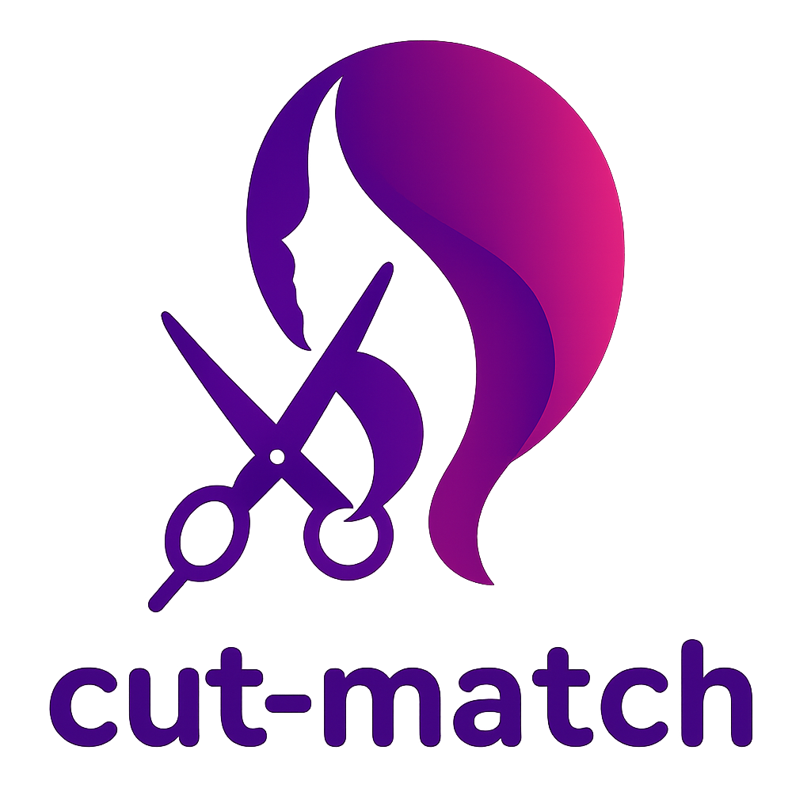
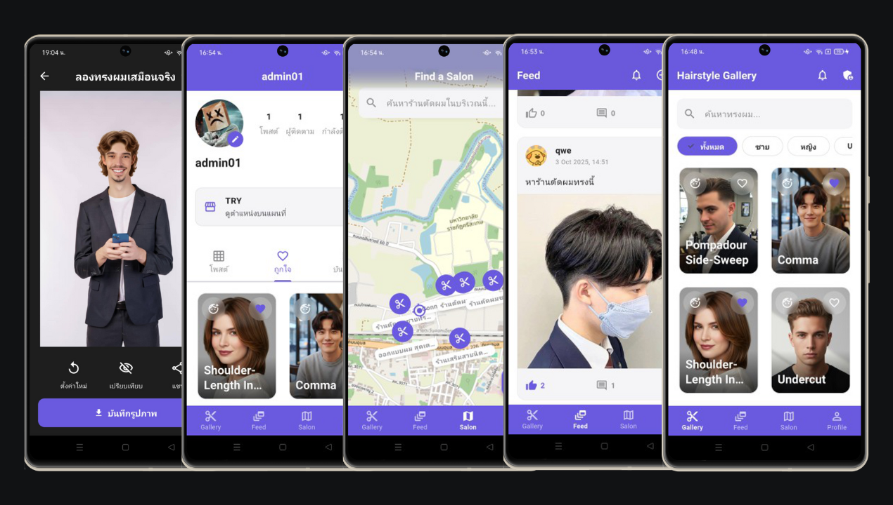

<div align="center">
  
  <h1>Cut Match: ลุคชัด-ตัดเลย</h1>
  <p>
    <strong>แอปพลิเคชันค้นหา, ลอง, และแบ่งปันสไตล์ทรงผม พร้อมฟังก์ชันโซเชียลเต็มรูปแบบ</strong>
  </p>
  <p>
    
    
    
  </p>
</div>

---

## 📖 Cut Match คืออะไร?
**Cut Match** คือแอปพลิเคชันสำหรับผู้ที่กำลังมองหาแรงบันดาลใจในการเปลี่ยนทรงผมใหม่ โดยผสมผสานระหว่างแกลเลอรีทรงผม, เครื่องมือช่วยเหลือการตัดสินใจ, และชุมชนออนไลน์เข้าไว้ด้วยกัน ผู้ใช้สามารถค้นหาทรงผมจากหลากหลายสไตล์, ลองทรงผมเสมือนจริงบนใบหน้าของตัวเอง, บันทึกไอเดีย, อ่านรีวิว, และแบ่งปันสไตล์ของตัวเองกับผู้ใช้คนอื่นๆ ได้อย่างครบวงจร

## ✨ ฟีเจอร์หลัก (Features)

- **🎨 การค้นพบสไตล์ (Style Discovery)**
  - **แกลเลอรีทรงผม:** ดูทรงผมทั้งหมดพร้อมรูปภาพสวยงาม
  - **ระบบค้นหาและฟิลเตอร์:** ค้นหาตามชื่อ, กรองตามเพศ, และแท็กสไตล์
  - **หน้ารายละเอียด:** ดูข้อมูลทรงผม, แกลเลอรีรูปภาพ, และอ่านรีวิวจากผู้ใช้อื่น
  - **ค้นหาร้านตัดผม:** แสดงร้านตัดผมใกล้เคียงบนแผนที่ (OpenStreetMap) พร้อมข้อมูลร้านและปุ่มนำทาง

- **📸 Virtual Try-On (ลองทรงผมเสมือนจริง)**
  - **AI-Powered Overlay:** ใช้ Google ML Kit วิเคราะห์ใบหน้าจากภาพนิ่ง (ถ่ายใหม่หรือเลือกจากแกลเลอรี)
  - **Interactive Wig:** "สวม" ทรงผม (ภาพพื้นหลังใส) ลงบนใบหน้าผู้ใช้โดยอัตโนมัติ
  - **ปรับแต่งได้:** ผู้ใช้สามารถ ย้ายตำแหน่ง, ย่อ/ขยาย, และหมุน ทรงผมได้อย่างอิสระ
  - **บันทึกและแชร์:** บันทึกลุคที่ลองแล้วลงเครื่องและโปรไฟล์ หรือแชร์ไปยังโซเชียลมีเดียอื่นได้ทันที

- ** social ชุมชนออนไลน์ (Social Features)**
  - **ระบบติดตาม:** Follow / Unfollow ผู้ใช้คนอื่น
  - **ฟีดส่วนตัว:** Timeline ที่แสดงโพสต์ล่าสุดจากคนที่คุณติดตาม
  - **สร้างโพสต์:** แชร์เรื่องราวทรงผมของคุณเอง พร้อมข้อความและรูปภาพ (รองรับหลายรูป)
  - **ระบบโต้ตอบ:** กดไลค์ (👍), คอมเมนต์, ตอบกลับคอมเมนต์ (Nested), และแชร์โพสต์
  - **จัดการเนื้อหา:** ผู้ใช้สามารถแก้ไขและลบโพสต์/คอมเมนต์ของตัวเองได้
  - **ค้นหาผู้ใช้:** ค้นหาเพื่อนหรือช่างทำผมคนโปรด

- **👤 การจัดการโปรไฟล์**
  - **โปรไฟล์สาธารณะ:** แสดงข้อมูล, สถิติ (Followers/Following/Posts), และแกลเลอรีโพสต์
  - **จัดการข้อมูล:** แก้ไขชื่อ, รหัสผ่าน, รูปโปรไฟล์, และเพิ่มลิงก์แผนที่ร้านของตัวเอง
  - **คอลเลกชันส่วนตัว:**
    - **My Favorites:** รายการทรงผมที่กด ❤️ ไว้
    - **My Saved Looks:** แกลเลอรีรูปภาพทั้งหมดที่เคยลองและบันทึกไว้

- **🔔 ระบบแจ้งเตือน**
  - **In-App Banner:** มีแบนเนอร์แสดงที่ด้านบนของจอเมื่อมีการแจ้งเตือนใหม่ (ขณะใช้แอป)
  - **หน้าแจ้งเตือน:** แสดงประวัติการแจ้งเตือนทั้งหมด (ไลค์, คอมเมนต์, ติดตาม)
  - **Real-time (Polling):** มีการเช็คการแจ้งเตือนใหม่ๆ เบื้องหลังเป็นระยะ

---

## 🛠️ เทคโนโลยีและสถาปัตยกรรม (Tech Stack & Architecture)

- **Core:** Flutter, Dart
- **State Management:** Provider
- **Networking:** http
- **Local Storage:** shared_preferences
- **Device Features:** image_picker, camera, geolocator, gal, url_launcher, share_plus
- **AI / Machine Learning:** google_mlkit_face_detection
- **Mapping:** flutter_map (OpenStreetMap)
- **UI:** flutter_svg, flutter_rating_bar

#### โครงสร้างโปรเจค (`lib/`)
```
/lib
├── api/          # ส่วนจัดการการเชื่อมต่อ API และ Service ต่างๆ
├── models/       # พิมพ์เขียวข้อมูล (Data Models)
├── providers/    # ส่วนจัดการสถานะของแอป (State Management)
├── screens/      # โฟลเดอร์หลักสำหรับแต่ละหน้าจอ
├── utils/        # ไฟล์เสริมต่างๆ เช่น Theme, Icons, Helpers
└── widgets/      # Widget ที่สร้างขึ้นเพื่อใช้ซ้ำ
```

---

## 🔌 Backend API
แอปพลิเคชันนี้ทำงานร่วมกับ **Cut Match API** ซึ่งเป็น Backend ที่สร้างด้วย Node.js, Express, และ MongoDB
- **ดูโค้ดของ API: [https://github.com/Cha-Khiao/cut-match-api.git](https://github.com/Cha-Khiao/cut-match-api.git)**
- **ดูเอกสาร API (Swagger): [https://cut-match-api.vercel.app/api-docs](https://cut-match-api.vercel.app/api-docs)**
---

## 🚀 การติดตั้งและรันโปรเจค (Getting Started)

### สิ่งที่ต้องมี
- Flutter SDK (v3.x หรือสูงกว่า)
- Android Studio / VS Code with Flutter extension
- Emulator หรืออุปกรณ์จริงสำหรับทดสอบ

### ขั้นตอนการติดตั้ง
1.  **Clone a repository:**
    ```bash
    git clone [https://github.com/your-username/cut-match-app.git]
    cd cut-match-app
    ```

2.  **ติดตั้ง Dependencies:**
    ```bash
    flutter pub get
    ```

3.  **ตั้งค่า API URL:**
    - เปิดไฟล์ `lib/api/api_service.dart`
    - แก้ไขตัวแปร `_baseUrl` ให้เป็น URL ของ API ที่คุณ Deploy ไว้
      ```dart
      static const String _baseUrl = '[https://your-api-url.vercel.app/api]';
      ```

4.  **รันแอปพลิเคชัน:**
    ```bash
    flutter run
    ```
---

## 📸 ตัวอย่างภาพหน้าจอ (Screenshots)



## 🤝 การมีส่วนร่วม (Contributing)
ยินดีต้อนรับทุกการมีส่วนร่วม! หากคุณมีไอเดียที่จะทำให้โปรเจคนี้ดีขึ้น กรุณา Fork a repository และสร้าง Pull Request หรือเปิด Issue เพื่อแจ้งบั๊กได้เลย

---

## 📜 สัญญาอนุญาต (License)
โปรเจคนี้อยู่ภายใต้สัญญาอนุญาตแบบ MIT License ซึ่งหมายความว่าคุณสามารถนำโค้ดนี้ไปศึกษา, ดัดแปลง, และใช้งานต่อได้ตามต้องการ

---

## 👨‍💻 ผู้พัฒนา (Developed By)

<div align="center">

🧑‍🎓**ทีมงานก้องน้อยนอนนา**

🎓**สาขาวิทยาการคอมพิวเตอร์ & คณะศิลปศาสตร์และวิทยาศาสตร์**

🏫**มหาวิทยาลัยราชภัฏศรีสะเกษ**

**Happy Coding! 🚀**

</div>